# Part 1 — Installing osTicket

[🏠 Main Project](README.md) | [Next: Post-Installation Configuration →](02-configuration.md)

## Overview

For this project, I wanted to build a working help desk environment from the ground up rather than only use an already-configured ticketing system.

I deployed osTicket on a Windows 11 Enterprise virtual machine in Microsoft Azure and configured the components it depends on: IIS for the web server, PHP for the application runtime, and MySQL for the database.

The final environment used:

- Windows 11 Enterprise
- Microsoft Azure
- Internet Information Services (IIS)
- PHP 7.3.8
- PHP Manager for IIS
- IIS URL Rewrite Module
- Microsoft Visual C++ Redistributable
- MySQL Server 5.5.62
- HeidiSQL
- osTicket v1.15.8

The Azure VM creation itself is covered in my other infrastructure projects, so this walkthrough begins with preparing Windows to host osTicket.

---

## Getting IIS Ready

osTicket is a PHP web application, so the first thing I needed was a web server.

On Windows, I used **Internet Information Services (IIS)**.

From Control Panel, I opened:

**Programs → Turn Windows features on or off**

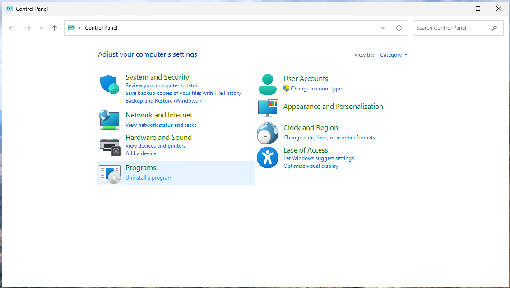

Inside IIS, I enabled:

**World Wide Web Services → Application Development Features → CGI**

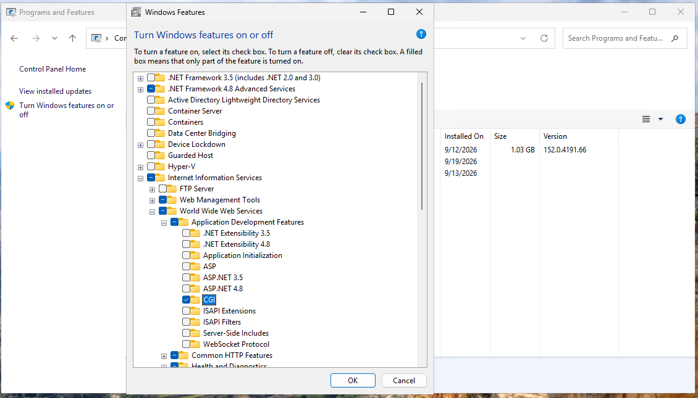

CGI is important here because PHP is handled through FastCGI in IIS. Without that application-development feature enabled, IIS would not be able to process the PHP application correctly.

---

## Adding the PHP Components

I installed **PHP Manager for IIS** so I could register and manage the PHP runtime directly from IIS Manager.

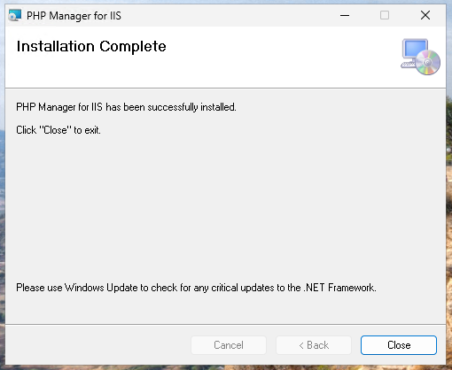

I also installed the **IIS URL Rewrite Module**.

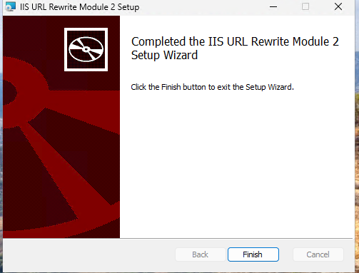

The PHP build supplied with the lab also required the Microsoft Visual C++ runtime, so I installed the included **Visual C++ Redistributable (x86)**.

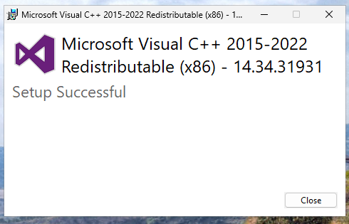

I then created:

`C:\PHP`

and extracted PHP 7.3.8 into that directory.

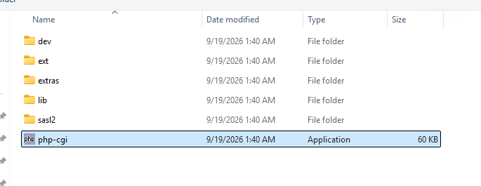

Using a dedicated `C:\PHP` directory made it easy to point IIS directly to the PHP executable later.

---

## Setting Up the Database Server

osTicket needs a database for its application data, including tickets, users, departments, configuration settings, and other help desk information.

I installed **MySQL Server 5.5.62** using the Typical setup.

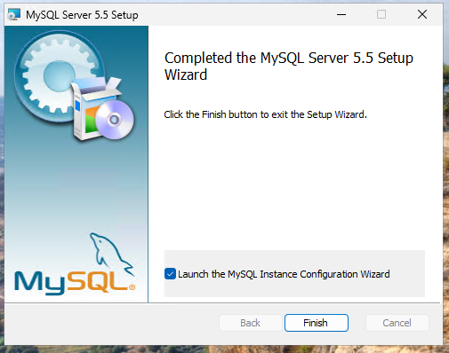

After installation, I ran the MySQL configuration wizard using the Standard Configuration.

The final screen confirmed that:

- The configuration file was created
- The MySQL Windows service was installed
- The service started successfully
- Security settings were applied

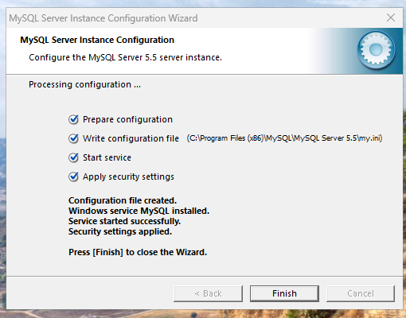

At this point, the database server itself was running, but osTicket still needed its own database.

---

## Connecting PHP to IIS

With PHP extracted, I returned to IIS and opened **PHP Manager**.

I registered:

`C:\PHP\php-cgi.exe`

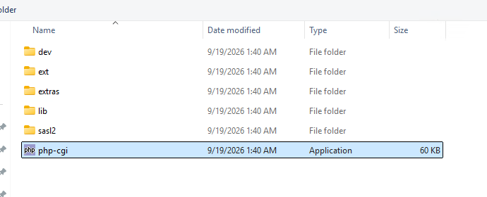

After registration, PHP Manager showed that IIS recognized PHP 7.3.8 and its configuration.

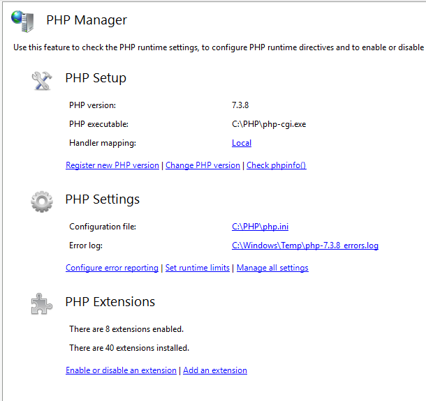

This was an important checkpoint because IIS could now process PHP instead of only serving static web content.

---

## Placing osTicket in the IIS Web Root

Next, I extracted the osTicket v1.15.8 package.

The application files were inside a folder named `upload`.

I moved that folder into:

`C:\inetpub\wwwroot`

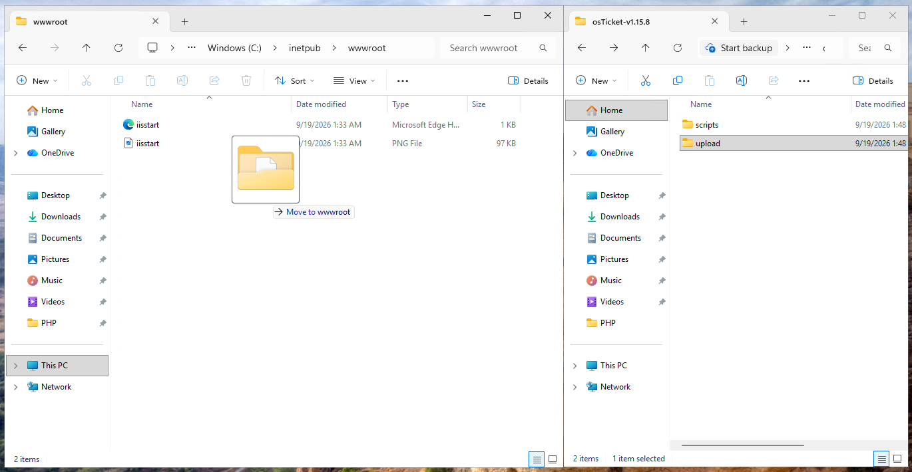

I then renamed `upload` to:

`osTicket`

which gave me the final path:

`C:\inetpub\wwwroot\osTicket`

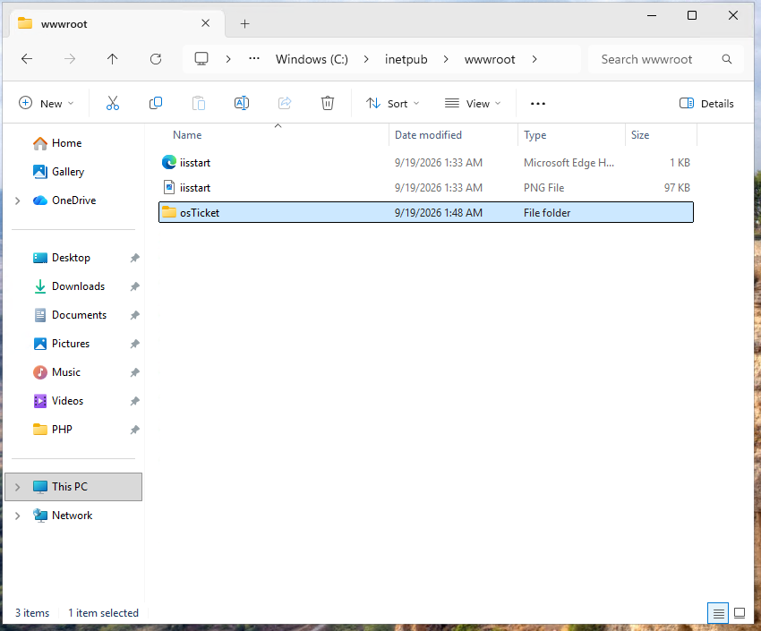

`C:\inetpub\wwwroot` is the default IIS web root, so placing the application there allowed IIS to serve osTicket through the browser.

---

## Reloading IIS

After adding the application files, I restarted IIS so the web server would reload the environment.

I stopped the server:

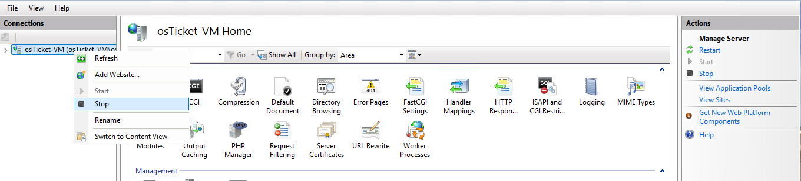

and then started it again:

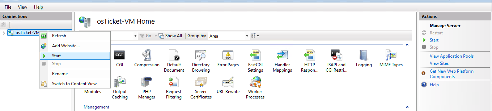

After the restart, I was able to open the osTicket installer locally.

---

## Checking the osTicket Prerequisites

One thing I liked about this part of the installation was that osTicket performs its own prerequisite check.

When I first opened the installer, it showed which PHP components were available and which recommended extensions were still missing.

I returned to PHP Manager and enabled the extensions used by the lab:

- `php_imap.dll`
- `php_intl.dll`
- `php_opcache.dll`

I then refreshed the osTicket installer.

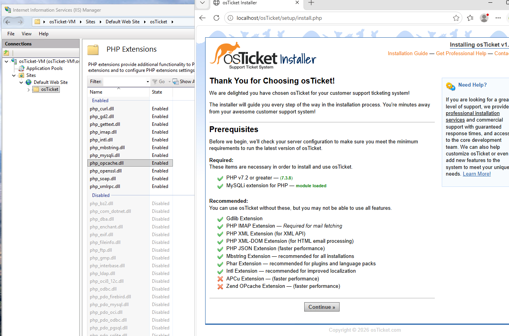

The required PHP and MySQL components were detected successfully.

One thing I noticed was that `php_opcache.dll` showed as enabled in PHP Manager, while osTicket still displayed Zend OPcache as unavailable. Because it was listed as a recommended component rather than a required one, it did not prevent the installation from continuing.

That was a useful reminder that the application’s own prerequisite check is more important than assuming a setting worked just because it was enabled in another tool.

---

## Preparing the osTicket Configuration File

Before continuing, I prepared the configuration file that osTicket uses to store its installation settings.

Inside:

`C:\inetpub\wwwroot\osTicket\include`

I renamed:

`ost-sampleconfig.php`

to:

`ost-config.php`

I temporarily allowed the installer to write to that file so it could save the application configuration.

After the installation was finished, I removed that write access again.

---

## Starting the osTicket Installer

Once the server requirements were ready, I continued to the main osTicket installation page.

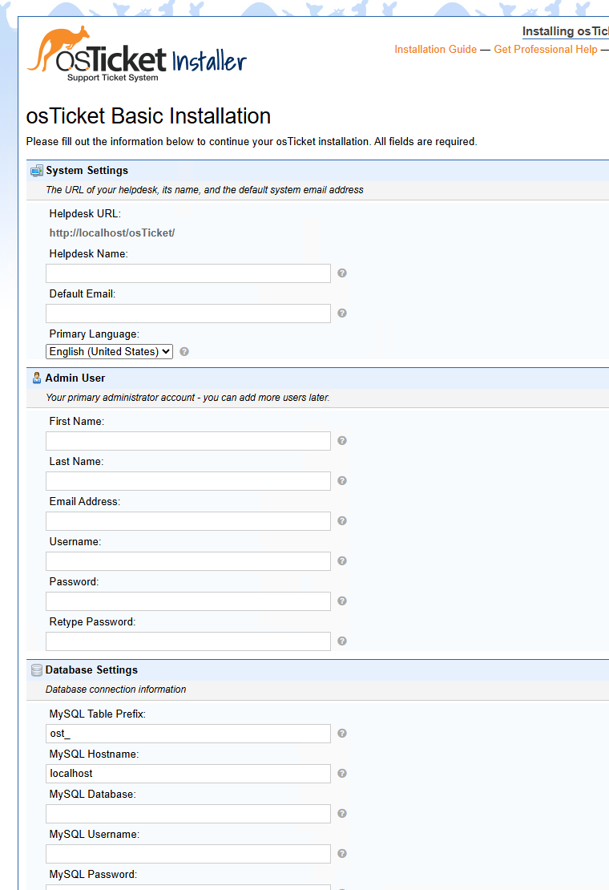

The installer asked for three main sets of information:

- Help desk settings
- The first administrator account
- MySQL database connection information

Before completing the database section, I created the database osTicket would use.

---

## Creating the osTicket Database

I installed **HeidiSQL** as a graphical client for MySQL.

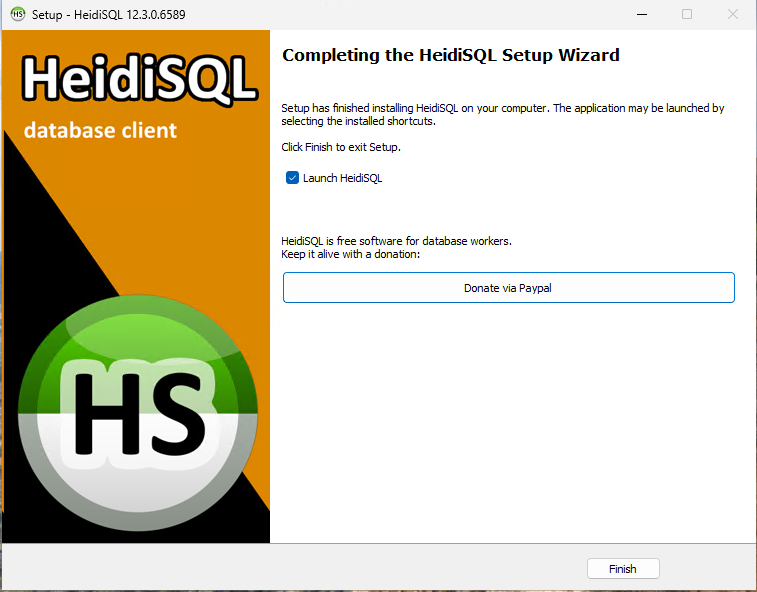

After connecting to the local MySQL server, I selected:

**Create new → Database**

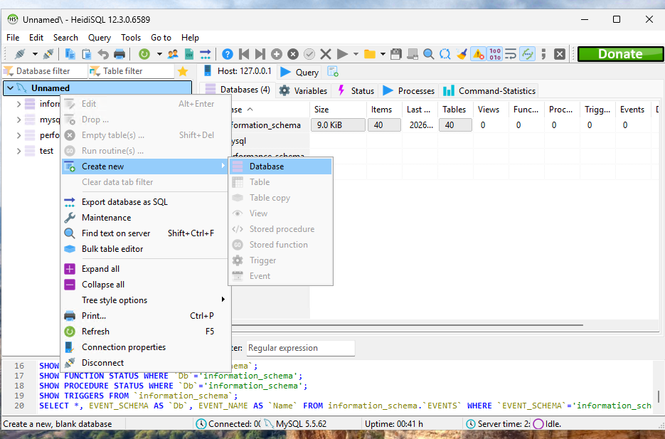

I created a database named:

`osTicket`

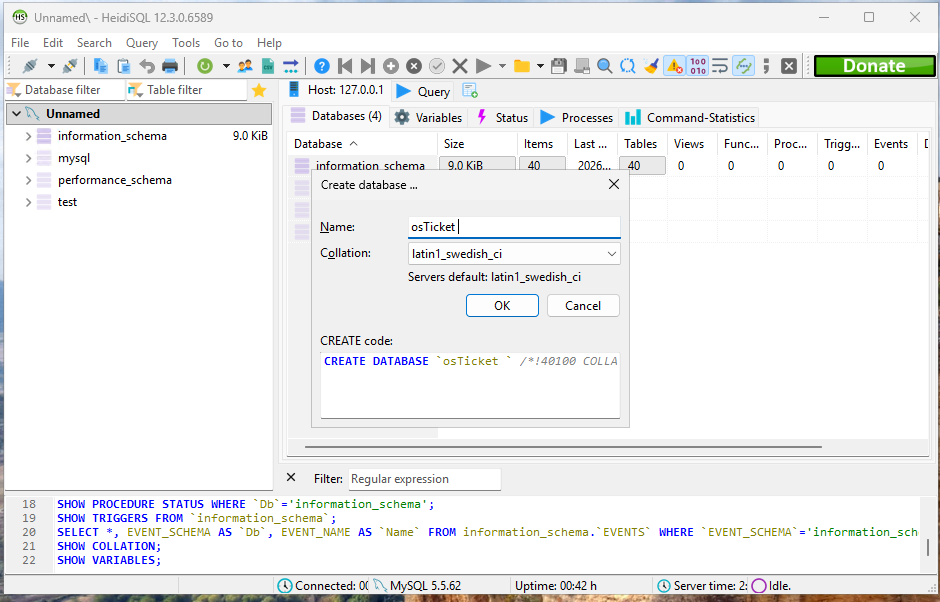

That database became the backend for the ticketing system.

---

## Connecting osTicket to MySQL

I returned to the osTicket installer and entered the help desk, administrator, and database settings.

For the database connection, I used:

- **Hostname:** `localhost`
- **Database:** `osTicket`
- **MySQL user:** `root`

Sensitive account information has been obscured in the screenshot.

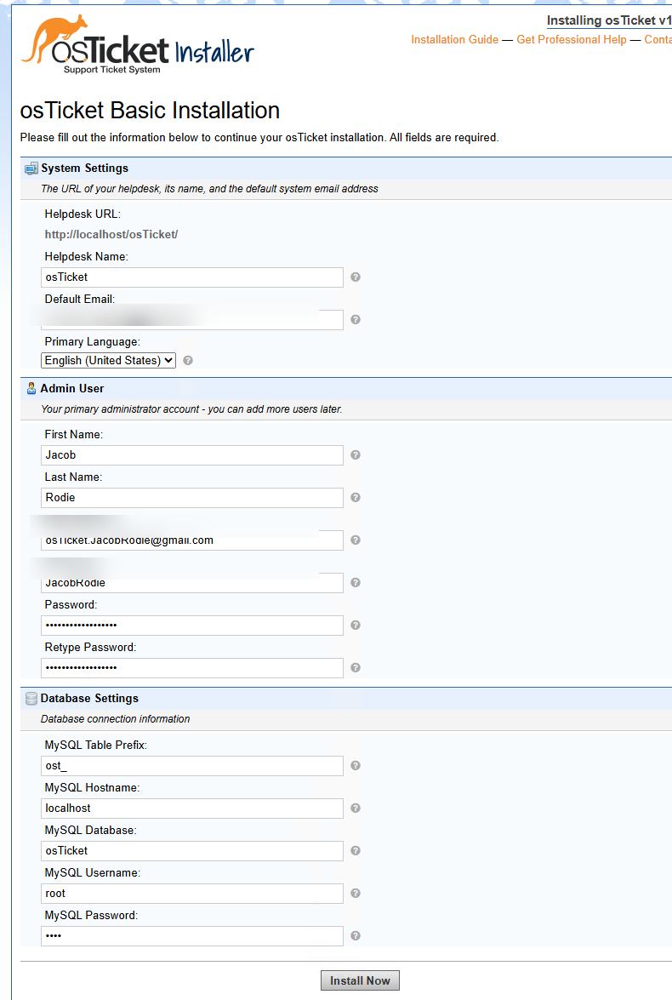

Because MySQL was running on the same virtual machine as osTicket, the database host could be referenced as `localhost`.

After confirming the settings, I started the installation.

---

## Verifying the Installation

The installer completed successfully.

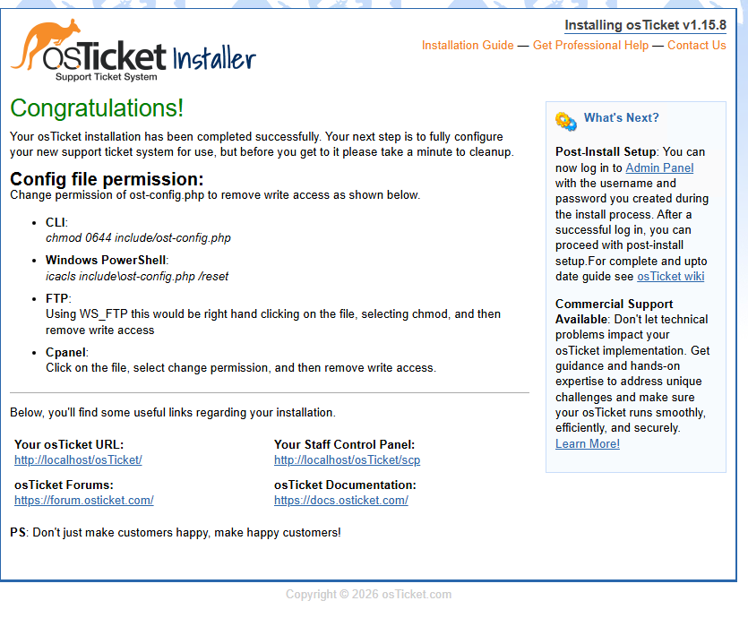

At that point, osTicket provided two main interfaces:

### End-User Portal

`http://localhost/osTicket/`

This is the side of the system where users submit and follow support requests.

### Staff Control Panel

`http://localhost/osTicket/scp/login.php`

This is where administrators and help desk agents configure the system and work tickets.

Getting to this point confirmed that IIS, PHP, MySQL, and osTicket were all communicating correctly.

---

## Post-Installation Cleanup

The last part of the installation was cleaning up the installer.

I deleted:

`C:\inetpub\wwwroot\osTicket\setup`

and changed:

`C:\inetpub\wwwroot\osTicket\include\ost-config.php`

back to **Read-only**.

The configuration file needed write access during installation, but once the settings had been written there was no reason to leave it writable.

With that complete, the installation portion of the project was finished.

---

## What I Took Away From This

The most useful part of this installation was seeing how the different pieces fit together.

Before doing the project, it would have been easy to think of osTicket as one program that simply gets installed. In reality, the application depends on several separate components:

```text
Browser
   ↓
IIS
   ↓
PHP
   ↓
osTicket
   ↓
MySQL
```

If one of those layers is not configured correctly, the application may not work even though the other pieces are installed.

This part of the project gave me hands-on experience working with a Windows web server, PHP, services, application files, file permissions, and a MySQL database. It also gave me practice verifying each stage instead of assuming that an installation succeeded.

The next part of the project focuses on turning the fresh installation into an actual help desk environment by configuring departments, roles, agents, users, SLAs, Help Topics, and ticket settings.

---

[🏠 Main Project](README.md) | [Next: Post-Installation Configuration →](02-configuration.md)
