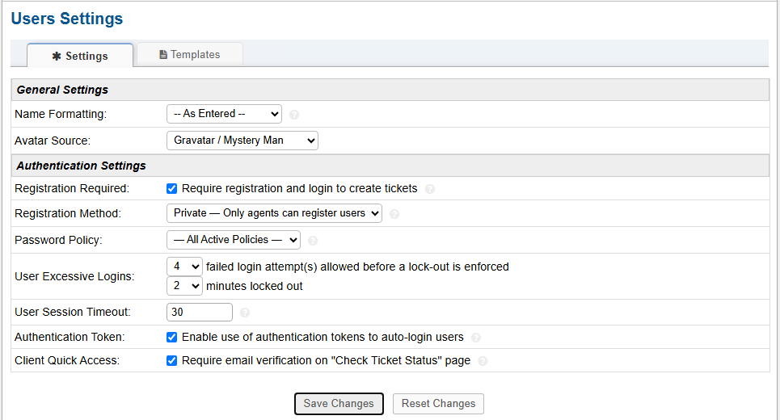
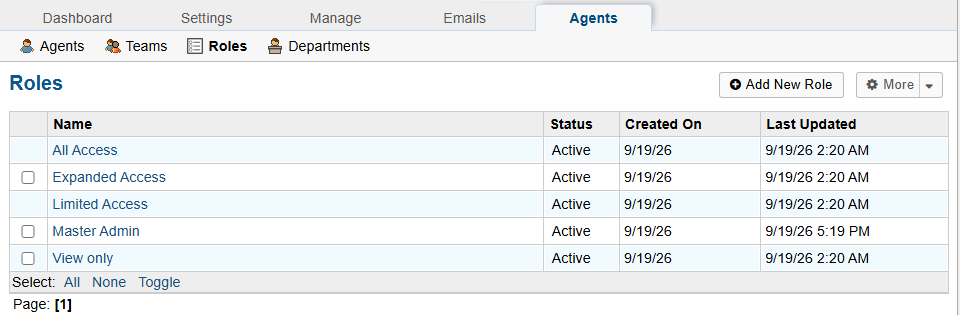
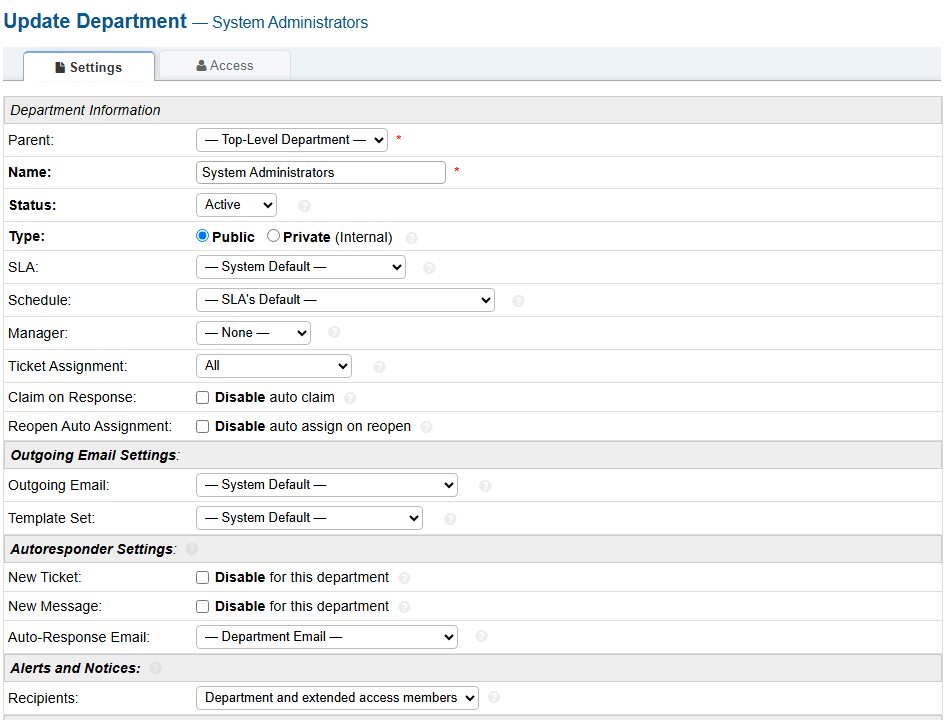
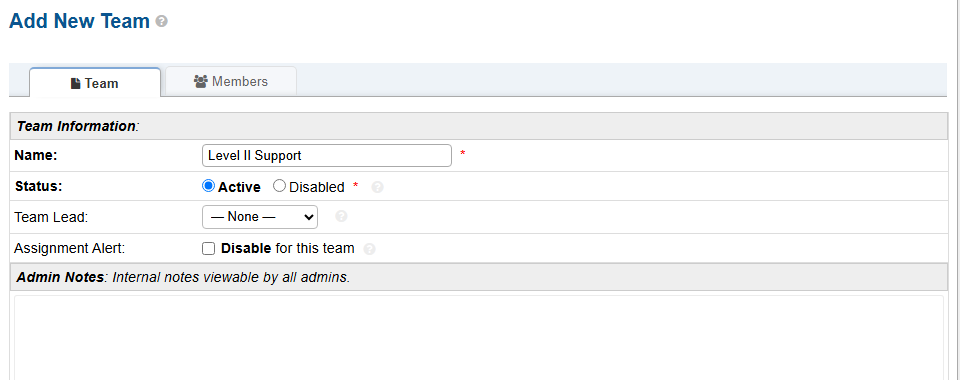
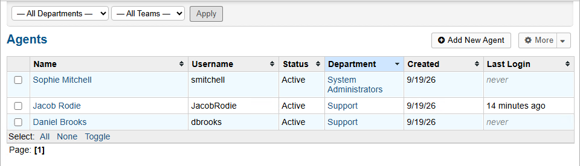
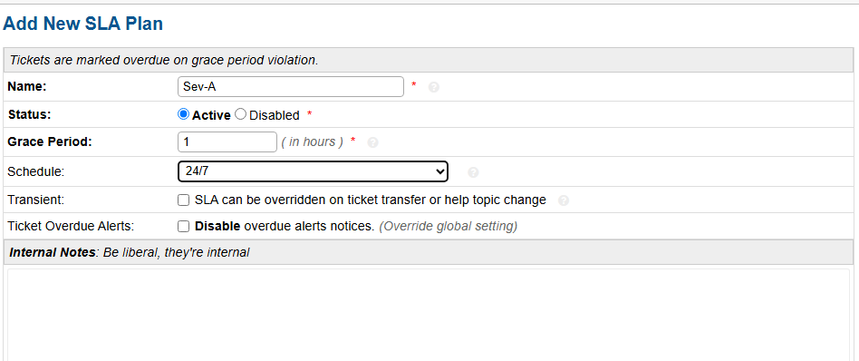
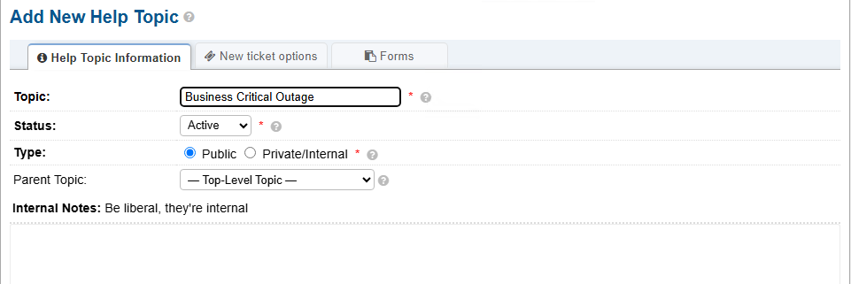

# Part 2 — Post-Installation Configuration

[← Previous: Installation](01-installation.md) | [🏠 Main Project](README.md) | [Next: Ticket Lifecycle →](03-ticket-lifecycle.md)

## Overview

With osTicket installed and running, the next stage is to configure the application into a structured help desk environment.

A fresh osTicket installation provides the ticketing platform, but additional configuration is required to control user access, organize support staff, establish permissions, define escalation resources, and create service expectations for different types of support requests.

This section covers the configuration of:

* User authentication and registration
* Roles and permissions
* Departments
* Support teams
* Support agents
* Service Level Agreements (SLAs)
* Help Topics

These components provide the administrative structure that will be used during the ticket lifecycle scenarios in Part 3.

---

## How the Configuration Fits Together

The post-installation configuration can be viewed as several connected parts of the help desk:

```text
End User
   ↓
Help Topic
   ↓
Support Ticket
   ↓
Department
   ↓
Support Agent
   ↓
Level II Support
   ↓
System Administrators
   ↓
SLA / Service Expectations
   ↓
Resolution
```

Each component serves a different purpose.

**Users** submit requests, **Help Topics** categorize those requests, **Departments** and **Teams** organize support responsibilities, **Agents** work the tickets, and **SLAs** establish service expectations.

---

## Configuring User Access

User settings determine how end users are allowed to access the help desk and create support requests.

From the Admin Panel, navigate to the **User Settings** page.

For this environment, registration is required before a user can create a ticket.

The registration method is configured as:

**Private — Only agents can register users**



Additional authentication settings include:

* **Registration Required:** Enabled
* **Registration Method:** Private — Only agents can register users
* **Password Policy:** All Active Policies
* **Failed Login Attempts:** 4
* **Lockout Duration:** 2 minutes
* **User Session Timeout:** 30 minutes
* **Authentication Tokens:** Enabled
* **Email Verification:** Required when checking ticket status

Requiring users to authenticate provides greater control over who can create and access support requests.

---

## Configuring Roles and Permissions

Roles determine what actions an agent is permitted to perform inside osTicket.

Navigate to:

**Admin Panel → Agents → Roles**

The environment contains the standard osTicket roles along with an additional **Master Admin** role.



The available roles are:

* All Access
* Expanded Access
* Limited Access
* Master Admin
* View Only

Roles allow different levels of access to be assigned according to an agent's responsibilities.

For example, an agent responsible for normal ticket handling does not necessarily require the same administrative permissions as someone responsible for managing the help desk configuration.

This provides a basic role-based access structure within the ticketing system.

---

## Creating the System Administrators Department

Departments organize support personnel and provide destinations for ticket assignment and transfer.

Navigate to:

**Admin Panel → Agents → Departments**

Create a department named:

**System Administrators**



The department is configured with:

* **Name:** System Administrators
* **Status:** Active
* **Type:** Public
* **SLA:** System Default
* **Schedule:** SLA's Default
* **Ticket Assignment:** All

The **System Administrators** department provides a separate support area for issues that require higher-level technical or administrative attention.

The existing **Support** department can continue to handle general help desk requests, while more advanced issues can be transferred when necessary.

---

## Creating a Level II Support Team

Teams allow agents to be grouped for a particular support responsibility without changing their primary department.

Navigate to:

**Admin Panel → Agents → Teams**

Create a team named:

**Level II Support**



The team is configured as **Active**.

The Level II Support team provides an escalation resource for tickets that cannot be resolved during initial troubleshooting.

A typical support path can therefore follow this structure:

```text
Support Agent
     ↓
Initial Troubleshooting
     ↓
Issue Requires Additional Expertise
     ↓
Level II Support
```

Teams are useful because they allow additional support resources to become involved without requiring the original agent's department structure to be changed.

---

## Configuring Support Agents

Agents are the staff members who access the osTicket Staff Control Panel and work support requests.

Navigate to:

**Admin Panel → Agents → Agents**

Create the agent accounts required for the help desk and assign each account to the appropriate department.



The configured environment contains three active agents:

| Agent | Department |
|---|---|
| Sophie Mitchell | System Administrators |
| Jacob Rodie | Support |
| Daniel Brooks | Support |

This creates a small support structure with both general help desk personnel and a separate system administration resource.

Support agents can receive tickets, document troubleshooting, communicate with users, and transfer or escalate tickets when additional assistance is required.

---

## Creating a Critical SLA

A **Service Level Agreement (SLA)** defines the amount of time available before a ticket is considered overdue.

Navigate to the SLA configuration area and create a new SLA plan named:

**Sev-A**



Configure the SLA with:

* **Name:** Sev-A
* **Status:** Active
* **Grace Period:** 1 hour
* **Schedule:** 24/7

The one-hour grace period provides a shorter service window for high-impact issues that require urgent attention.

Using the **24/7** schedule also means the SLA is not limited to normal business hours.

A critical outage affecting business operations, for example, requires a different level of urgency than a routine support request.

---

## Creating a Business Critical Outage Help Topic

Help Topics provide users with predefined categories when submitting support requests.

Navigate to the Help Topic configuration area and create a new Help Topic named:

**Business Critical Outage**



Configure the Help Topic with:

* **Topic:** Business Critical Outage
* **Status:** Active
* **Type:** Public
* **Parent Topic:** Top-Level Topic

Making the topic **Public** allows it to be presented as an available category for support requests.

This provides a clear intake category for major incidents and can be used alongside the critical-ticket handling process demonstrated later in the project.

---

## Understanding the Escalation Structure

The departments, teams, agents, Help Topics, and SLA settings now provide a basic escalation structure for the help desk.

For example:

```text
User Reports an Issue
        ↓
Business Critical Outage
        ↓
Support Agent Reviews Ticket
        ↓
Initial Troubleshooting
        ↓
Issue Cannot Be Resolved
        ↓
Level II Support
        ↓
System Administrators if Required
        ↓
Resolution
```

The **Level II Support** team and **System Administrators** department provide destinations for issues requiring additional technical expertise.

The **Sev-A** SLA provides a service expectation for urgent incidents, while the **Business Critical Outage** Help Topic gives users a clear way to identify a major service disruption when submitting a request.

These components do not replace troubleshooting; they provide the structure used to organize and manage the troubleshooting process.

---

## Verifying the Help Desk Structure

At this stage, the osTicket installation has been configured with the administrative components needed to begin handling support requests.

The environment now contains:

* Controlled user registration and authentication
* Multiple agent permission levels
* A Master Admin role
* A System Administrators department
* An active Level II Support team
* Three active support agents
* A Sev-A SLA with a one-hour grace period
* A 24/7 SLA schedule
* A Business Critical Outage Help Topic

Together, these settings turn the fresh osTicket installation from Part 1 into an organized help desk environment.

---

## Configuration Summary

The post-installation configuration establishes the structure needed to move a ticket through the support process:

```text
Ticket Submission
      ↓
Categorization
      ↓
Prioritization
      ↓
Assignment
      ↓
Troubleshooting
      ↓
Escalation
      ↓
Resolution
      ↓
Documentation
      ↓
Closure
```

The next section demonstrates this process using support tickets from the end-user and agent perspectives.

[Next: Part 3 — Ticket Lifecycle →](03-ticket-lifecycle.md)

---

[← Previous: Installation](01-installation.md) | [🏠 Main Project](README.md) | [Next: Ticket Lifecycle →](03-ticket-lifecycle.md)
