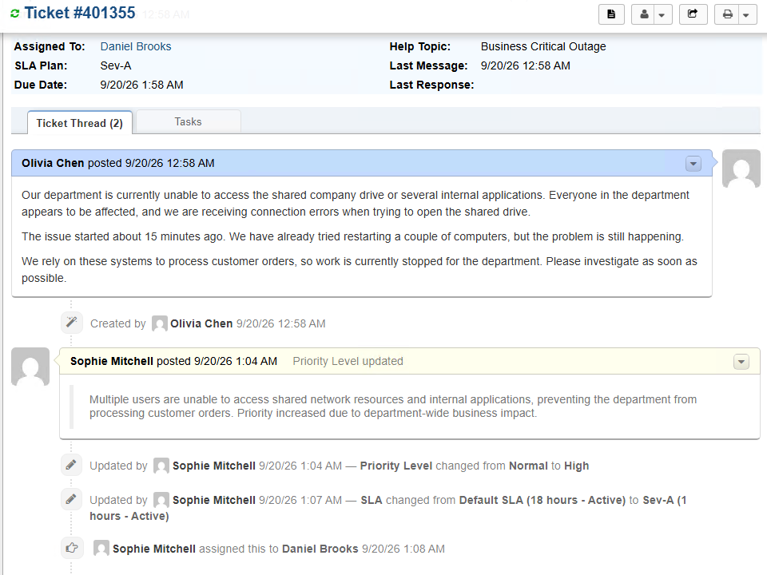

# Part 3 — Ticket Lifecycle

[← Previous: Post-Installation Configuration](02-configuration.md) | [🏠 Main Project](README.md)

## Overview

With the osTicket environment installed and configured, the final stage demonstrates how support requests move through the help desk from initial submission to resolution.

Rather than treating every request the same way, each ticket is evaluated based on its impact, urgency, required support resources, and appropriate service level.

Three ticket scenarios are used to demonstrate different help desk workflows:

| Ticket | Scenario | Workflow |
|---|---|---|
| 1 | Business Critical Outage | Critical incident with escalation |
| 2 | User Login / Account Access Issue | Standard Tier 1 troubleshooting |
| 3 | Routine Support Request | Lower-priority support workflow |

Together, the scenarios demonstrate ticket intake, triage, prioritization, assignment, troubleshooting, escalation, communication, documentation, resolution, and closure.

---

## Ticket Lifecycle Workflow

The general support process used throughout the scenarios is:

```text
Ticket Submitted
      ↓
Review & Triage
      ↓
Determine Impact / Priority
      ↓
Assign Agent / Department
      ↓
Select Appropriate SLA
      ↓
Troubleshoot
      ↓
Escalate if Required
      ↓
Document Resolution
      ↓
Close Ticket
```

Not every ticket requires every step.

For example, a routine account issue may be resolved by the first support agent, while a business-critical outage may require escalation to Level II Support or System Administrators.

---

# Ticket 1 — Business Critical Outage

## Scenario

A user reports an issue affecting business operations.

This ticket demonstrates how a high-impact incident can be identified, prioritized, assigned an appropriate SLA, investigated, and escalated when additional technical expertise is required.

### Ticket Classification

| Field | Configuration |
|---|---|
| Help Topic | Business Critical Outage |
| Priority | High / Emergency |
| SLA | Sev-A |
| Initial Department | Support |
| Escalation | Level II Support / System Administrators |

---

## Ticket Intake

Open the osTicket end-user portal and create a new support request.

Select:

**Help Topic → Business Critical Outage**

Enter a clear issue summary and description that explains:

- What service is affected
- Who is affected
- When the problem began
- What the user is experiencing

> Add a screenshot of the submitted Business Critical Outage ticket here.

```markdown

```

A useful ticket description should provide enough information for the support agent to begin evaluating the issue without immediately requesting basic details from the user.

---

## Triage and Prioritization

Open the ticket from the Staff Control Panel and review the reported symptoms.

During triage, evaluate:

- Number of affected users
- Business impact
- Urgency
- Service availability
- Appropriate support resources
- Required SLA

Because this scenario represents a significant business disruption, assign the ticket the appropriate critical priority and **Sev-A SLA**.

> Add screenshot showing the ticket priority and SLA.

```markdown

```

The Sev-A plan configured in Part 2 provides a **one-hour grace period on a 24/7 schedule**, reflecting the higher urgency of this incident type.

---

## Assignment

Assign the ticket to the appropriate Support agent or department for initial investigation.

> Add screenshot showing assignment.

```markdown

```

Assignment establishes clear ownership so the ticket does not remain unassigned while troubleshooting is performed.

---

## Initial Troubleshooting

Begin troubleshooting using the information supplied in the ticket.

Document each meaningful action taken during the investigation.

Examples may include:

- Confirming the scope of the outage
- Verifying whether multiple users are affected
- Checking network connectivity
- Testing access to the affected service
- Reviewing relevant system information
- Determining whether the issue can be resolved by Tier 1

> Add screenshot showing troubleshooting notes or ticket activity.

```markdown

```

Internal notes should clearly record what you tested, what you observed, and why you took the next action.

---

## Escalation

If you can't resolve the issue during initial troubleshooting, escalate the ticket to the appropriate higher-level resource.

The environment configured in Part 2 provides:

**Level II Support**

and:

**System Administrators**

for issues requiring additional technical expertise.

```text
Support
   ↓
Initial Troubleshooting
   ↓
Level II Support
   ↓
System Administrators
```

> Add a screenshot showing the escalation or transfer.

```markdown

```

Escalate when the issue requires additional expertise or access, not simply because troubleshooting is difficult.

---

## Resolution and Documentation

Once you address the underlying issue, document the final resolution in the ticket.

A useful resolution note should explain:

- What caused the issue
- What action corrected it
- Whether service was restored
- Any relevant follow-up information

> Add a screenshot showing the final resolution.

```markdown

```

After confirming the issue is resolved, change the ticket status to **Closed**.

---

## Ticket 1 Outcome

This scenario demonstrates:

- Critical incident intake
- Impact-based prioritization
- Sev-A SLA usage
- Ticket ownership
- Troubleshooting documentation
- Level II / System Administrator escalation
- Resolution
- Ticket closure

---

# Ticket 2 — User Login / Account Access Issue

## Scenario

A user reports being unable to access an account or service.

Unlike the Business Critical Outage scenario, this issue affects a single user and can be handled through the normal Tier 1 support process.

### Ticket Classification

| Field | Configuration |
|---|---|
| Issue Type | Account / Login Issue |
| Impact | Single User |
| Initial Department | Support |
| Escalation | Not required unless troubleshooting fails |

---

## Ticket Intake

Submit the issue through the end-user portal with a clear description of the login problem.

> Add a screenshot of Ticket 2 submission.

```markdown

```

---

## Triage and Assignment

Review the request from the Staff Control Panel.

Because the problem affects a single user rather than a business-wide service, it should not receive the same priority or SLA treatment as the critical outage.

Assign the ticket to a Support agent.

> Add a screenshot showing Ticket 2 assignment.

```markdown

```

---

## Troubleshooting

Troubleshoot the issue using an appropriate process.

Possible checks may include:

- Confirming the username
- Confirming the affected application or system
- Checking whether credentials are being entered correctly
- Determining whether the account is locked
- Testing access after corrective action
- Confirming successful login with the user

Document only the actions actually performed during the scenario.

> Add a screenshot showing troubleshooting documentation.

```markdown

```

---

## Resolution

Document the corrective action and communicate the resolution to the user.

> Add a screenshot of the resolution.

```markdown

```

Once access has been restored and verified, close the ticket.

---

## Ticket 2 Outcome

This scenario demonstrates:

- Single-user incident handling
- Tier 1 troubleshooting
- Appropriate prioritization
- Agent communication
- Resolution documentation
- Ticket closure without unnecessary escalation

---

# Ticket 3 — Routine Support Request

## Scenario

The third ticket represents a routine support request, such as a printer issue or software-related request.

This demonstrates how lower-impact tickets can be handled without applying the same urgency used for outages or service-affecting incidents.

### Ticket Classification

| Field | Configuration |
|---|---|
| Request Type | Routine Support |
| Impact | Low / Individual User |
| Department | Support |
| Escalation | Only if required |

---

## Ticket Intake

Create the request through the end-user portal.

Include enough information for the support agent to understand the problem and begin troubleshooting.

> Add screenshot of Ticket 3 submission.

```markdown

```

---

## Assessment and Assignment

Review the request and determine its priority based on impact and urgency.

Assign the request to the appropriate Support agent.

> Add a screenshot showing assignment and priority.

```markdown

```

This scenario demonstrates that not every ticket should be treated as a high-priority incident.

Correct prioritization helps the help desk focus resources on the requests with the greatest business impact.

---

## Troubleshooting

Perform the appropriate troubleshooting steps and document the results.

The ticket history should provide a clear record of:

- Symptoms reported
- Checks performed
- Changes made
- User communication
- Final result

> Add a screenshot showing troubleshooting activity.

```markdown

```

---

## Resolution and Closure

Once you've corrected the issue, provide the user with a clear resolution message.

Document what resolved the issue before closing the ticket.

> Add a screenshot showing Ticket 3 resolution.

```markdown

```

---

## Ticket 3 Outcome

This scenario demonstrates:

- Routine ticket intake
- Appropriate prioritization
- Standard agent assignment
- Troubleshooting
- User communication
- Documentation
- Closure

---

# Comparing the Three Ticket Workflows

The three scenarios demonstrate that ticket handling changes depending on the impact and complexity of the issue.

| Workflow Area | Critical Outage | Login Issue | Routine Request |
|---|---|---|---|
| Business Impact | High | Individual User | Low / Individual |
| Urgency | Critical | Standard | Routine |
| SLA | Sev-A | Appropriate standard SLA | Appropriate standard SLA |
| Initial Support | Support | Support | Support |
| Escalation | Level II / System Administrators | Only if required | Only if required |
| Troubleshooting | Multi-stage | Tier 1 | Routine |
| Documentation | Detailed incident history | Resolution notes | Resolution notes |
| Final Status | Closed | Closed | Closed |

Prioritization and escalation are not meant to make every ticket follow the same path. It ensures each request receives the level of attention appropriate to its business impact and technical requirements.

---

# Ticket Lifecycle Complete

At this stage, the osTicket environment has been demonstrated from initial deployment through actual ticket handling.

The complete project now covers:

```text
Part 1
osTicket Installation
      ↓
Part 2
Help Desk Configuration
      ↓
Part 3
Ticket Intake & Triage
      ↓
Assignment
      ↓
Troubleshooting
      ↓
Escalation
      ↓
Resolution
      ↓
Documentation
      ↓
Closure
```

The three scenarios show how the help desk configuration created in Part 2 applies to different types of support requests while maintaining clear ownership, prioritization, communication, and documentation.

---

[← Previous: Post-Installation Configuration](02-configuration.md) | [🏠 Main Project](README.md)
