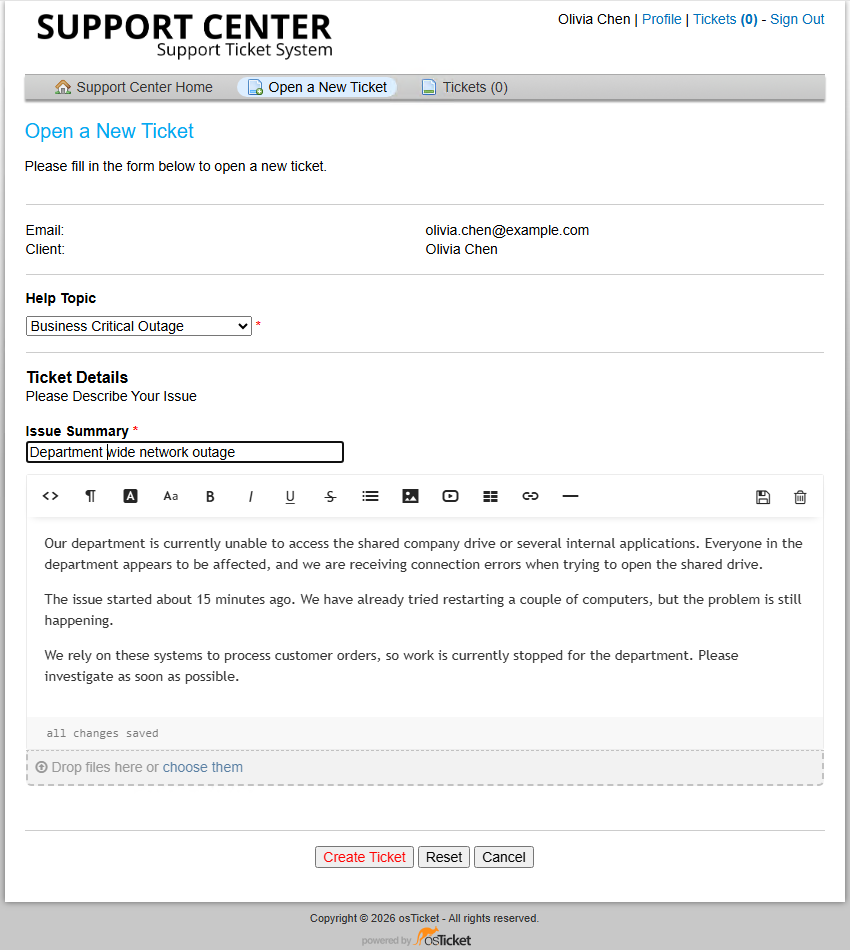
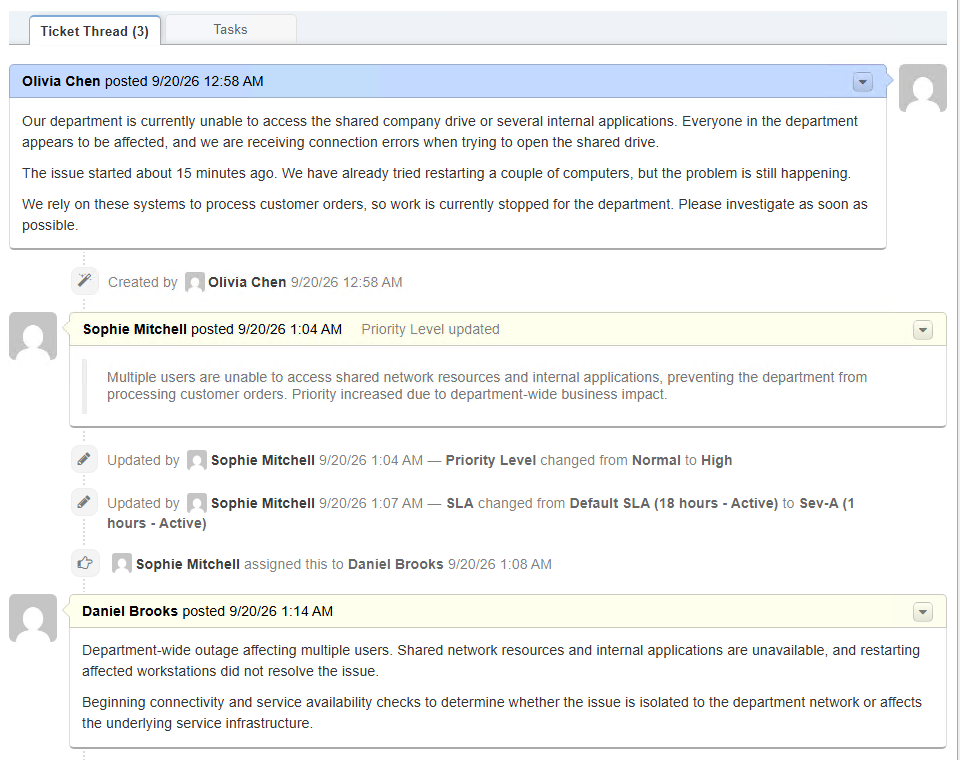
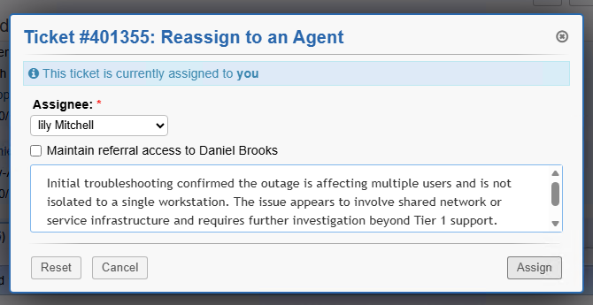
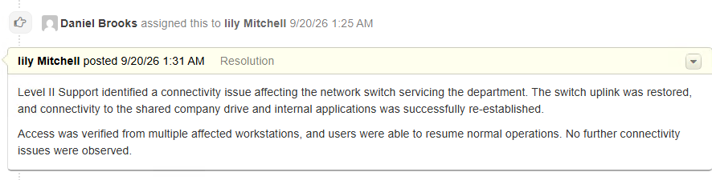
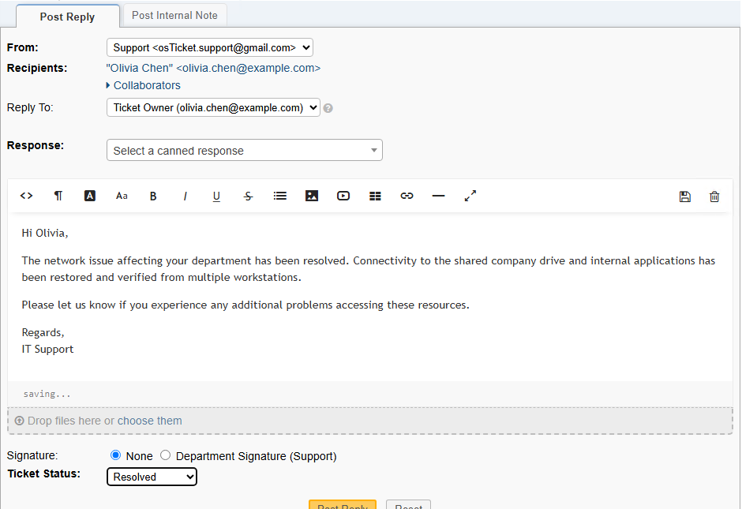

# Part 3 — Ticket Lifecycle

[← Previous: Post-Installation Configuration](02-configuration.md) | [🏠 Main Project](README.md)

## Overview

With the osTicket environment installed and configured, this section demonstrates how a support request moves through the help desk from initial submission to final closure.

The scenario simulates a **department-wide network outage** affecting multiple users. It was selected because it provides an opportunity to demonstrate the complete ticket lifecycle, including:

- Ticket intake
- Triage and prioritization
- SLA selection
- Agent assignment
- Initial assessment
- Troubleshooting documentation
- Escalation to Level II Support
- Resolution documentation
- User communication
- Ticket closure

Rather than creating several repetitive examples, this walkthrough follows one ticket from beginning to end so you can review the entire support process in a single audit trail.

---

## Ticket Scenario

| Field | Configuration |
|---|---|
| Ticket | #401355 |
| User | Olivia Chen |
| Issue | Department-wide network outage |
| Help Topic | Business Critical Outage |
| Initial Priority | Normal |
| Updated Priority | High |
| SLA | Sev-A |
| Initial Department | Support |
| Initial Agent | Daniel Brooks |
| Escalation | Level II Support |
| Level II Agent | Lily Mitchell |
| Final Status | Closed |

For this lifecycle demonstration, **Lily Mitchell** is used as the Level II escalation agent.

---

## Ticket Lifecycle Workflow

The incident follows this support path:

```text
Ticket Submission
      ↓
Triage
      ↓
Priority Increased to High
      ↓
Sev-A SLA Applied
      ↓
Assigned to Support
      ↓
Initial Assessment
      ↓
Troubleshooting
      ↓
Escalated to Level II Support
      ↓
Infrastructure Issue Identified
      ↓
Connectivity Restored
      ↓
User Notified
      ↓
Resolved
      ↓
Closed
```

---

## Ticket Intake

The incident begins from the end-user portal.

The user selects **Business Critical Outage** as the Help Topic and reports that the department can't access the shared company drive or several internal applications.

The description also identifies the business impact: multiple users are affected, and customer-order processing has stopped.



The issue summary is kept concise:

**Department-wide network outage**

A clear issue summary helps support staff understand the request scope before opening the full ticket.

---

## Triage, Priority, and SLA

After the ticket enters the help desk queue, the team reviews the reported impact.

The ticket is initially created with **Normal** priority. Because the outage affects multiple users and prevents the department from processing customer orders, the team increases the priority to **High**.

The ticket history documents the reason for the priority change.

The default SLA is also changed to the **Sev-A** plan configured in Part 2.


The audit trail records:

- Priority changed from **Normal → High**
- SLA changed from **Default SLA → Sev-A**
- Ticket assigned to **Daniel Brooks**

The Sev-A SLA provides a one-hour grace period on a 24/7 schedule, making it appropriate for a high-impact incident requiring prompt attention.

---

## Initial Assignment and Assessment

The ticket is assigned to **Daniel Brooks** in the Support department for initial investigation.

The first internal assessment summarizes the reported symptoms and documents the next troubleshooting objective.



The assessment records that:

- Multiple users are affected
- Shared network resources and internal applications are unavailable
- Restarting affected workstations did not resolve the problem
- Connectivity and service availability require further investigation

This provides a clear starting point for troubleshooting and preserves the reasoning in the ticket history.

---

## Troubleshooting and Escalation Decision

Further troubleshooting confirms that the issue is not isolated to a single workstation.

The ticket notes record that multiple endpoints are affected and that the impacted systems still cannot reach shared resources.

![Troubleshooting and escalation documentation](images/tickets/04-critical-ticket-troubleshooting-escalation.pthe impactede the symptoms indicate a broader network or service-infrastructure proble;, the issue is documented as requiring investigation beyond Tier 1 support.

The escalation reason is recorded before reassignment so the next support resource can understand what has already been checked and why the ticket is being escalated.

---

## Escalating to Level II Support

The ticket is reassigned from **Daniel Brooks** to **Lily Mitchell** for Level II handling.

The reassignment reason states that the issue affects multiple users, is not isolated to one workstation, and appears to involve shared network or service infrastructure.



Documenting the reason for escalation helps prevent duplicated troubleshooting and gives the receiving agent the context needed to continue the investigation.

---

## Resolution

Level II Support identifies a connectivity issue affecting the network switch servicing the department.

The resolution note documents that the switch uplink was restored and access to the shared company drive and internal applications was re-established.



The ticket also records that connectivity was verified from multiple affected workstations before the incident was considered resolved.

A useful resolution note should explain both **what caused the issue** and **what action restored service**.

---

## User Communication

After the service is restored, the user receives a final update confirming the network issue has been resolved.

The response confirms that access to the shared drive and internal applications has been restored and verified.

The ticket status is then changed to **Resolved**.



This gives the user a clear outcome without exposing unnecessary internal troubleshooting details.

---

## Ticket Closure

After documenting the resolution and notifying the user, the ticket is removed from the active queue.

The ticket is then verified in the **Closed** queue.


The closed-ticket record confirms:

- Ticket **#401355**
- Subject: **Department wide network outage**
- Submitted by **Olivia Chen**
- Closed by **Lily Mitchell**
- Final ticket status: **Closed**

---

## Ticket Outcome

This scenario demonstrates the complete lifecycle of a high-impact support incident:

```text
User reports outage
      ↓
Support reviews business impact
      ↓
Priority raised to High
      ↓
Sev-A SLA applied
      ↓
Ticket assigned to Tier 1 Support
      ↓
Initial assessment documented
      ↓
Troubleshooting performed
      ↓
Issue escalated with documented reason
      ↓
Level II identifies infrastructure issue
      ↓
Service restored and verified
      ↓
User receives resolution update
      ↓
Ticket closed
```

The ticket history provides a continuous record of the decisions made throughout the incident, including prioritization, ownership, troubleshooting, escalation, resolution, and closure.

This completes the osTicket project workflow established across the three parts:

```text
Part 1 — Installation
        ↓
Part 2 — Post-Installation Configuration
        ↓
Part 3 — Ticket Lifecycle
```

---

[← Previous: Post-Installation Configuration](02-configuration.md) | [🏠 Main Project](README.md)
