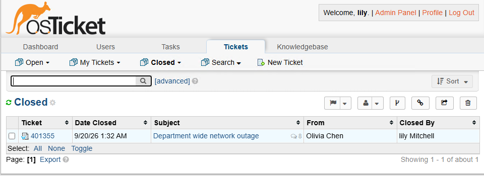

# osTicket Help Desk Deployment, Configuration & Ticket Lifecycle

## Project Summary

This project documents the deployment, configuration, and operation of an **osTicket help desk environment** that demonstrates a complete IT support workflow.

The environment is hosted on a **Windows 11 Enterprise virtual machine in Microsoft Azure** and includes the web server, PHP runtime, database services, help desk administration, and ticket-handling workflow required to operate osTicket.

The project is divided into three connected parts:

1. **Installation** — Preparing the Windows environment and deploying osTicket
2. **Post-Installation Configuration** — Configuring the help desk structure, users, support staff, permissions, SLAs, and ticket categories
3. **Ticket Lifecycle** — Processing a business-critical support request from submission through troubleshooting, escalation, resolution, and closure

Together, these sections demonstrate how a help desk ticketing system is deployed, configured, and used to support end users.

---

## Environment and Technologies

- Microsoft Azure
- Windows 11 Enterprise
- Microsoft Remote Desktop
- Internet Information Services (IIS)
- osTicket v1.15.8
- PHP 7.3.8
- PHP Manager for IIS
- IIS URL Rewrite Module
- MySQL Server 5.5.62
- HeidiSQL
- Microsoft Visual C++ Redistributable

---

## Languages Used

No scripting or programming languages were required for this implementation.

Configuration was completed through Windows administration tools, IIS Manager, PHP Manager, HeidiSQL, and the osTicket administrative interface.

---

## What This Project Demonstrates

This project demonstrates practical skills relevant to Help Desk and Technical Support environments, including:

- Deploying and configuring a ticketing system
- Working with Windows-based application services
- Configuring IIS and PHP
- Connecting a web application to a MySQL database
- Managing help desk users and support agents
- Configuring roles and permissions
- Organizing departments and support teams
- Creating Service Level Agreements (SLAs)
- Configuring Help Topics
- Managing user authentication and registration
- Evaluating ticket impact and urgency
- Prioritizing support requests
- Assigning tickets to support personnel
- Documenting troubleshooting activity
- Escalating tickets when additional expertise is required
- Communicating resolution updates to users
- Documenting resolutions
- Closing completed support tickets

---

# Project Walkthrough

## Part 1 — Installing osTicket

The first stage prepares the Windows environment and installs the components required to run osTicket.

The installation includes:

- Enabling IIS and CGI
- Installing PHP Manager
- Installing the IIS URL Rewrite Module
- Installing the required Visual C++ runtime
- Installing and configuring MySQL
- Registering PHP with IIS
- Deploying osTicket to the IIS web root
- Creating the osTicket database
- Connecting osTicket to MySQL
- Verifying the completed installation
- Completing post-installation cleanup

The application stack used throughout the project is:

```text
Browser
   ↓
IIS
   ↓
PHP
   ↓
osTicket
   ↓
MySQL
```


[View Part 1 — Installing osTicket →](01-installation.md)

---

## Part 2 — Post-Installation Configuration

The second stage turns the fresh osTicket installation into a structured help desk environment.

The configuration includes:

- User authentication and registration settings
- Roles and permissions
- Departments
- Support teams
- Support agents
- Service Level Agreements
- Help Topics

The help desk also includes an escalation structure using the **Support department**, **Level II Support**, and **System Administrators** resources.

A **Sev-A SLA** was configured with a one-hour grace period on a 24/7 schedule for high-impact incidents, along with a **Business Critical Outage** Help Topic for major service disruptions.


[View Part 2 — Post-Installation Configuration →](02-configuration.md)

---

## Part 3 — Ticket Lifecycle

The final stage shows how the configured help desk processes a support request from beginning to end.

A **Business Critical Outage** demonstrates the complete lifecycle of a high-impact incident affecting multiple users and preventing normal department operations.

The ticket begins with an end user reporting a department-wide network outage and progresses through:

```text
Ticket Submission
      ↓
Review & Triage
      ↓
Priority Increased to High
      ↓
Sev-A SLA Applied
      ↓
Assigned to Tier 1 Support
      ↓
Initial Assessment
      ↓
Troubleshooting
      ↓
Escalation to Level II Support
      ↓
Infrastructure Issue Identified
      ↓
Connectivity Restored
      ↓
User Notified
      ↓
Resolved
      ↓
Closed
```

The scenario shows how ticket history documents the reasoning behind priority changes, SLA selection, assignment, troubleshooting, escalation, and resolution.



[View Part 3 — Ticket Lifecycle →](03-ticket-lifecycle.md)

---

## How the Three Parts Connect

The project follows the progression of a complete help desk implementation:

```text
Part 1
Install the Ticketing Platform
        ↓
Part 2
Configure the Help Desk Structure
        ↓
Part 3
Process and Resolve a Support Incident
```

**Part 1** establishes the technical platform required to run osTicket.

**Part 2** defines how users, agents, roles, departments, teams, SLAs, and Help Topics operate within that platform.

**Part 3** demonstrates how those components work together during an actual support workflow involving intake, prioritization, assignment, troubleshooting, escalation, resolution, communication, and closure.

---

## Project Documentation

- [Part 1 — Installing osTicket](01-installation.md)
- [Part 2 — Post-Installation Configuration](02-configuration.md)
- [Part 3 — Ticket Lifecycle](03-ticket-lifecycle.md)
